# @daveyplate/better-auth-ui - https://better-auth-ui.com

Plug & play shadcn/ui auth components for [better-auth](https://better-auth.com).

- *Own your auth.*

[Demo](https://newtech.dev/auth/login) - [Documentation](https://better-auth-ui.com)

---

### Sign In

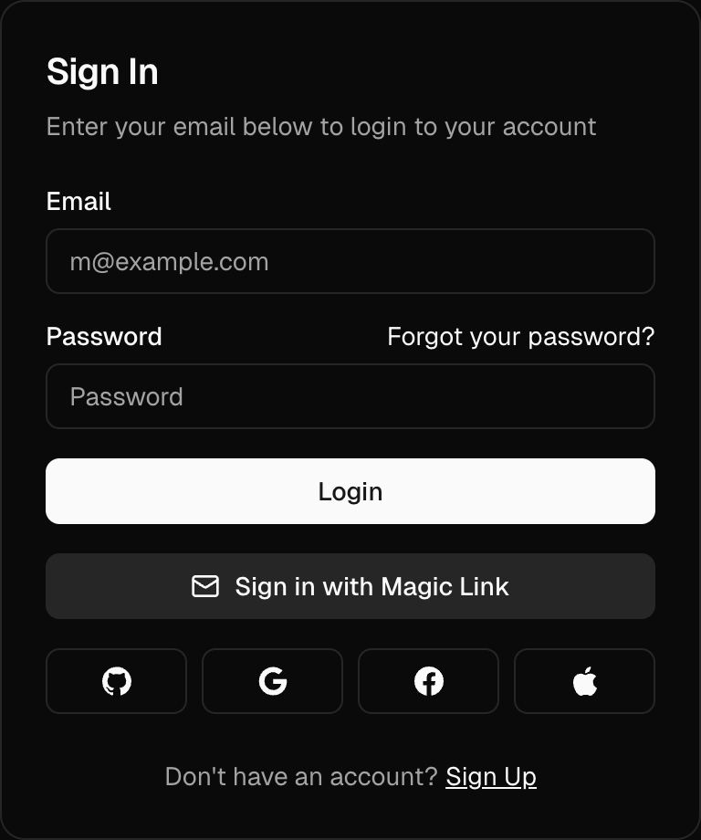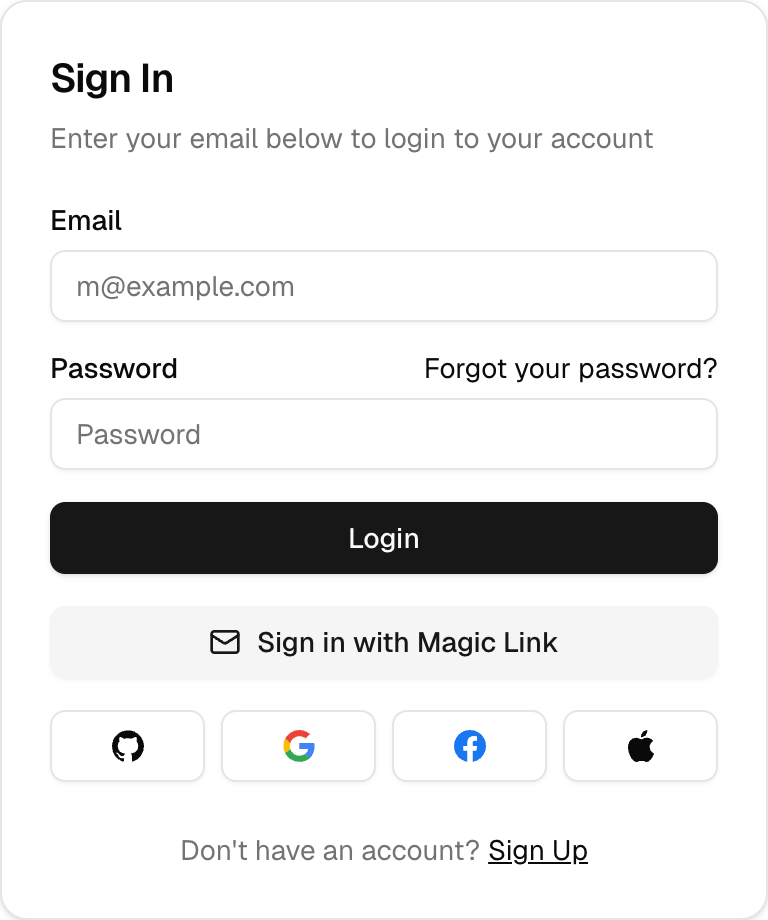

### Sign Up

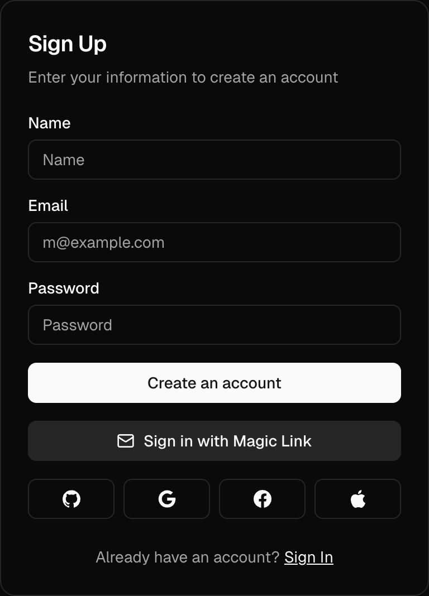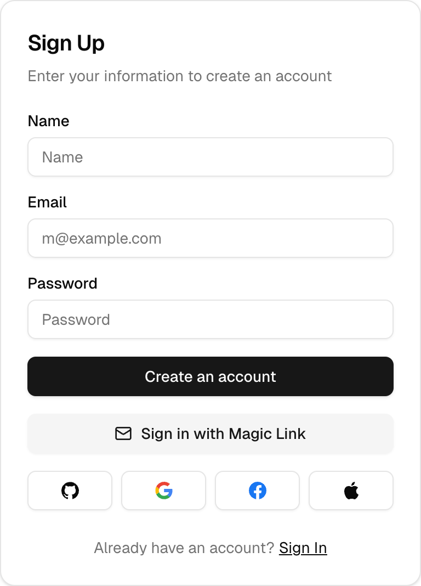

### Forgot Password

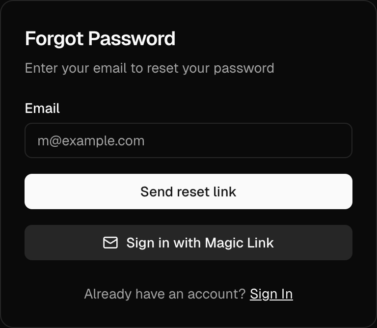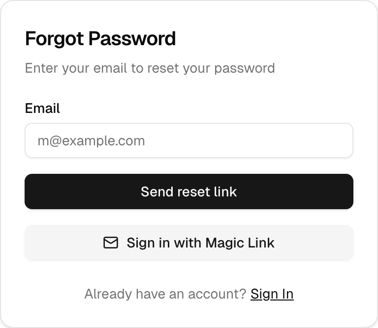

### User Button

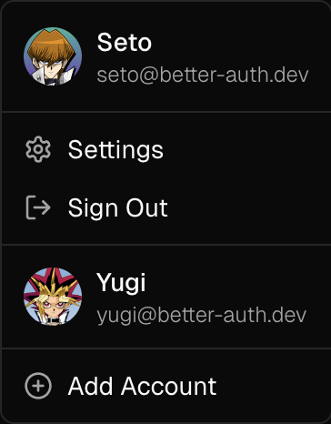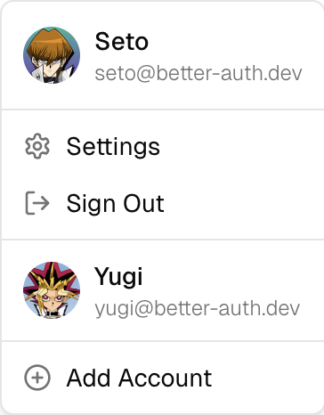

### Email Template

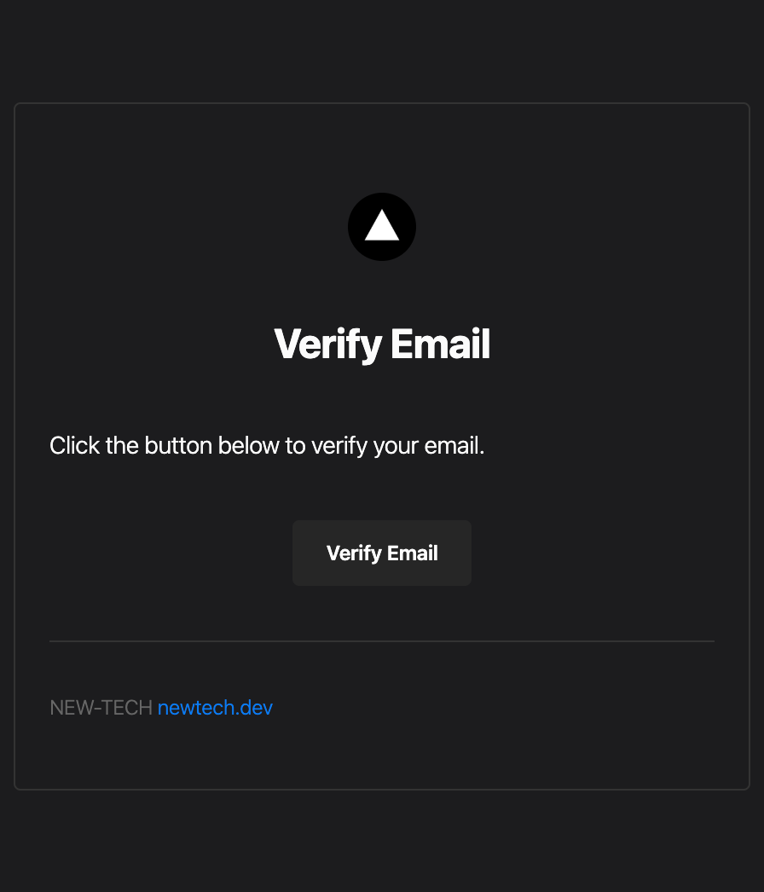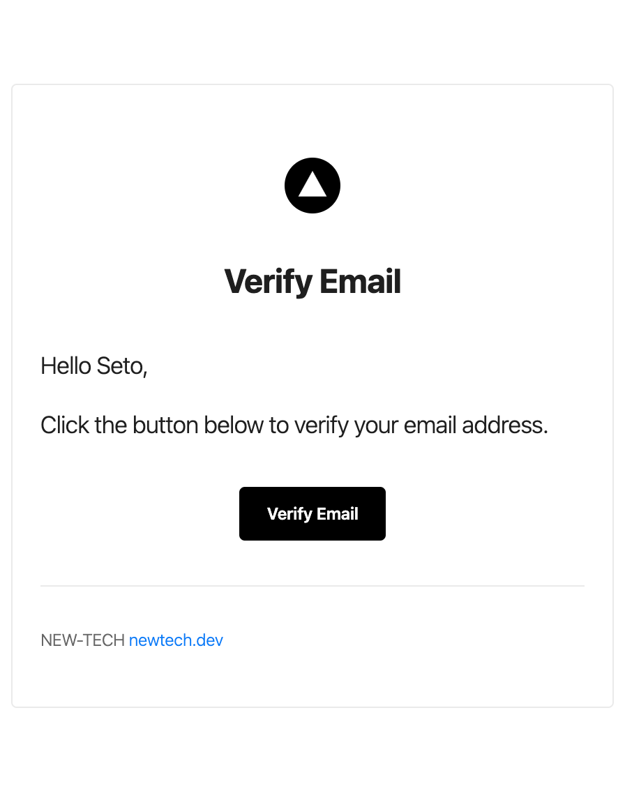

### Settings Cards

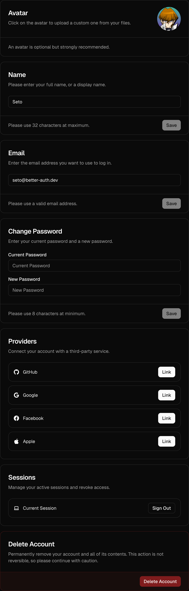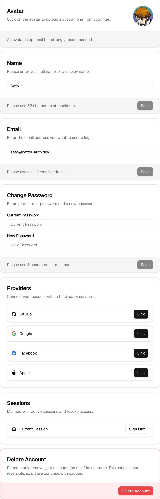

---

Fully customizable!

Coming Soon: Captcha, 2FA, and more!

## License

This project is licensed under the MIT License. See the LICENSE file for details.
