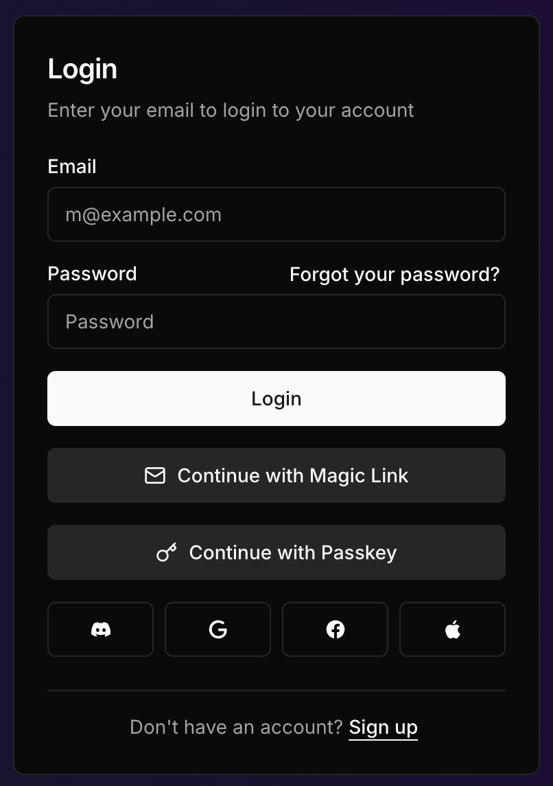

# @daveyplate/better-auth-ui

Plug & play shadcn/ui components for better-auth.

{ width=320px }

## Installation

To install the package, run:

```bash
npm install @daveyplate/better-auth-ui
```

## Usage

### Next.js Pages Router

If you don't provide a toast function, the AuthCard 
will render an inline Alert component for notifications.

`pages/auth/[auth].tsx`
```tsx
import { useCallback } from "react";
import { AuthCard } from "@daveyplate/better-auth-ui";
import { useRouter } from "next/router";
import Link from "next/link";
import { useToast } from "@/hooks/use-toast";
import { ToastAction } from "@/components/ui/toast";

export default function AuthPage() {
    const nextRouter = useRouter();
    const { toast } = useToast();

    const authToast = useCallback((
        { variant, description, action }: AuthToastOptions
    ) => {
        toast({
            variant,
            description,
            action: action && (
                <ToastAction
                    altText={action.label}
                    onClick={action.onClick}
                >
                    {action.label}
                </ToastAction>
            )
        })
    }, [toast]);

    return (
        <div className="flex justify-center items-center min-h-screen">
            <AuthCard 
                authClient={authClient} 
                nextRouter={nextRouter} 
                toast={authToast}
                LinkComponent={Link}
            />
        </div>
    );
}
```

### React

To use Better Auth UI in a React project, follow these steps:

Use disableRouting={true} if you don't want to use a dynamic path.

**Import and Use Components**:

`dynamic-auth-page-path.tsx`
```tsx
import { AuthCard } from "@daveyplate/better-auth-ui";
import { useNavigate, useLocation, NavLink } from "react-router-dom";

function App() {
    const navigate = useNavigate();
    const location = useLocation();

    return (
        <div className="flex justify-center items-center min-h-screen">
            <AuthCard 
                authClient={authClient} 
                navigate={navigate} 
                pathname={location.pathname} 
                LinkComponent={NavLink} 
            />
        </div>
    );
}

export default App;
```

## AuthCard Props

| Prop Name         | Type                                                                 | Description                                                                                       | Default Value               |
|-------------------|----------------------------------------------------------------------|---------------------------------------------------------------------------------------------------|-----------------------------|
| authClient        | `AuthClient`                                                         | The authentication client instance.                                                               | Required                    |
| navigate          | `(url: string) => void`                                              | Function to navigate to a different URL.                                                          | `undefined`           |
| pathname          | `string`                                                             | The current pathname.                                                                             | `undefined`  |
| nextRouter        | `NextRouter`                                                         | Next.js router instance.                                                                          | `undefined`                 |
| initialView       | `AuthView`                                                           | The initial view to display.                                                                      | `undefined`                 |
| emailPassword     | `boolean`                                                            | Enable email and password authentication.                                                         | `true`                      |
| username          | `boolean`                                                            | Enable username field for signup.                                                                 | `false`                     |
| forgotPassword    | `boolean`                                                            | Enable forgot password functionality.                                                             | `true`                      |
| magicLink         | `boolean`                                                            | Enable magic link authentication.                                                                 | `false`                     |
| passkey           | `boolean`                                                            | Enable passkey authentication.                                                                    | `false`                     |
| providers         | `SocialProvider[]`                                                   | List of social providers for authentication.                                                      | `[]`                        |
| socialLayout      | `"horizontal" \| "vertical"`                                         | Layout for social provider buttons.                                                               | `"vertical"`                |
| localization      | `Record<string, string>`                                | Localization strings for the component.                                                           | `undefined`       |
| disableRouting    | `boolean`                                                            | Disable internal routing.                                                                         | `false`                     |
| disableAnimation  | `boolean`                                                            | Disable animations.                                                                               | `false`                     |
| signUpWithName    | `boolean`                                                            | Enable name field for signup.                                                                     | `false`                     |
| callbackURL       | `string`                                                             | URL to redirect to after authentication.                                                          | `"/"`                       |
| authPaths         | `Record<AuthView, string>`                                  | Custom paths for authentication views.                                                            | `{}`                        |
| classNames        | `Record<string, string>`                                            | Custom class names for the component elements.                                                    | `{}`                        |
| componentStyle    | `"default" \| "new-york"`                                            | Style variant for the component.                                                                  | `"default"`                 |
| toast             | `(options: AuthToastOptions) => void`                                | Function to display toast notifications.                                                          | `undefined`                 |
| LinkComponent     | `React.ComponentType<{ href: string, to: any, className?: string, children: ReactNode }>` | Custom link component.                                                                            | `undefined`               |

## License

This project is licensed under the MIT License. See the LICENSE file for details.